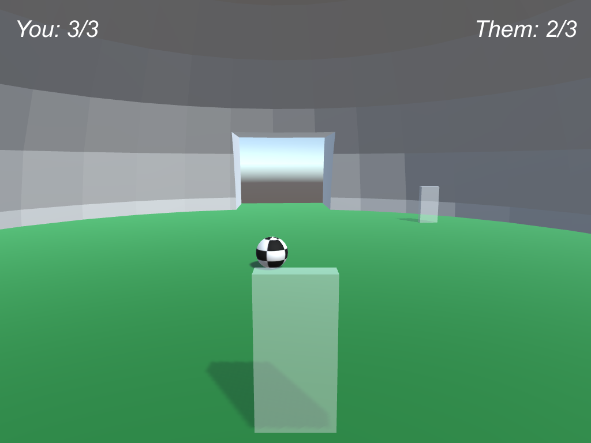
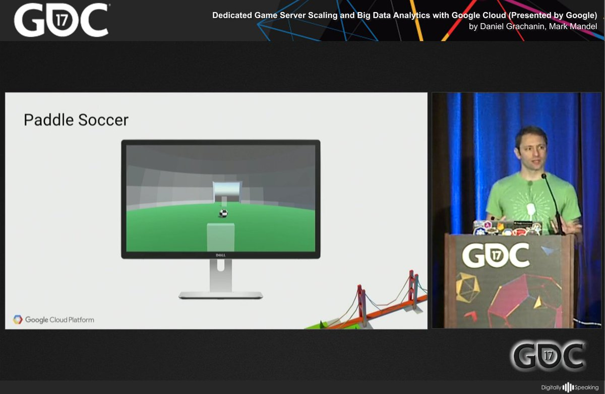

# Paddle Soccer

A simple, two player multiplayer game built to show how you can host dedicated game servers on [Kubernetes](https://kubernetes.io/).

It has been implemented using [Unity](https://unity.com) for the game client and dedicated game server, and [Go](https://golang.org/) for the backend service components that sit on top of Kubernetes.



## Overview

Game servers are started up as a [Pod](https://kubernetes.io/docs/user-guide/pods/) on request through the Kubernetes API, and configured to use [Host Networking](https://kubernetes.io/docs/resources-reference/v1.5/#pod-v1), to avoid any network latency issues through a Load Balancer. The Game Servers start on a random port between a given range (defaults to 2000-3000), and then register themselves against a custom API with their Pod name for later lookup.

Once the game server has started, we use the combination of the Kubernetes API and the aforementioned custom port registry to determine which node in the Kubernetes cluster the Pod has been scheduled on, that node's external IP and what port the game server is open on. This is then pass that back to the game client, through a match maker or otherwise, so that they can connect to it directly.

## Blog Posts

- [Scaling Dedicated Game Servers with Kubernetes: Part 1 - Containerising and Deploying](http://www.compoundtheory.com/scaling-dedicated-game-servers-with-kubernetes-part-1-containerising-and-deploying/)

## Presentations
[](http://www.gdcvault.com/play/1024328/)

## Unity Structure
The unity source code can be found in the `unity` folder.

It was built with [Unity 5.6.0](https://store.unity.com/download). It was built on Linux, but the
client should run on any OS.

To quickly make the Client and Server builds (for Linux), you can run the [Build Pipeline](https://docs.unity3d.com/ScriptReference/BuildPipeline.html) under the `Build > Build Game and Server` menu

Once the server infrastructure has been configured, you can start the game with a `-match` command line argument, to tell it where the matchmaker is. For example:

```bash
./Game.x86_64 -match "http://10.32.14.10" -logFile /dev/stdout
```

## Server

All the non-Unity server side code is found in the `server` folder.

### Infrastructure

This project works on Kubernetes [1.5.2](https://github.com/kubernetes/kubernetes/blob/master/CHANGELOG.md#v152) or higher, as it uses Kubernetes [StatefulSets](https://kubernetes.io/docs/tutorials/stateful-application/basic-stateful-set/).

If you have a [Google Cloud Platform](https://cloud.google.com/) Project configured and the [Google Cloud SDK](https://cloud.google.com/sdk/) installed, you can cd into the `infrastructure` folder, and run `make deploy` to deploy a 4 node cluster over 2 nodepools, as well as the accompanying firewall rules.  `make auth` will authenticate your local `kubectl` tooling with this cluster.

### Node Pools
- There are two [Node Pools](https://cloud.google.com/container-engine/docs/node-pools) withing this cluster. 
    - "apps" (Node Selector `role=apps`) - which is the area in which Sessons, Matchmaker and Nodescaler all run, so as to keep application separate 
    from the game servers, and not have them impact CPU performance.
    - "game-servers" (Node Selector `role=game-servers`) - for which game servers will be exclusively run on, and for ease of
    autoscaling.

### Game Server

The `game-server` folder contains Dockerfile for the Unity dedicated server. To build the server, and the image (on Linux) run `make build` and then `make push` to push the image up to [Container Registry](https://cloud.google.com/container-registry/) for use.

### Sessions

The `sessions` folder contains the Go application manages the HTTP API that creates new instances of the Unity Game Server within a Pod. It also hosts the HTTP API the that Game Server connects to to register the port that it currently runs on, with the podname is it provided through an Environment variable.

To build the code for the Docker image and push the image up to the Container Registry, run `make build push`. 
To deploy, run `make deploy-all` and it will deploy the [Redis](https://redis.io/) Stateful Set, and the 
[Kubernetes Deployment](https://kubernetes.io/docs/user-guide/deployments/) and accompanying [Service](https://kubernetes.io/docs/user-guide/services/).

### Matchmaker
The `matchmaker` folder contains a Go application that is a very simple HTTP based matchmaker that pairs the first two players that request a game in FIFO order. It coordinated with the session manager to start game servers, and inspect what IP and port they are running on, so it can be passed back to the client.

To build the code for the Docker image and push the image up to the Container Registry, run `make build push`. 
To deploy, run `make deploy-all` and it will deploy the Redis Stateful Set, and the Kubernetes Deployment and accompanying Service.

### NodeScaler

The `nodescaler` folder contains a Go application that tracks resource usage within the `game-server` node pool and
increases the number of nodes if the amount of CPU space available falls below a certain buffer value.

Note: Scaling nodes down will be implemented soon.

Currently only implemented to work on Google Cloud Platform, through its [Container Engine API](https://cloud.google.com/container-engine/reference/rest/) 
and [Compute Engine Instance Group Manager API](https://cloud.google.com/compute/docs/reference/latest/instanceGroupManagers), 
but has been written for extension if required.

To build the code for the Docker image and push the image up to the Container Registry, run `make build push`. 
To deploy, run `make deploy-all` and it will deploy the Kubernetes Deployment for this.


## Licence
Apache 2.0

This is not an official Google product.